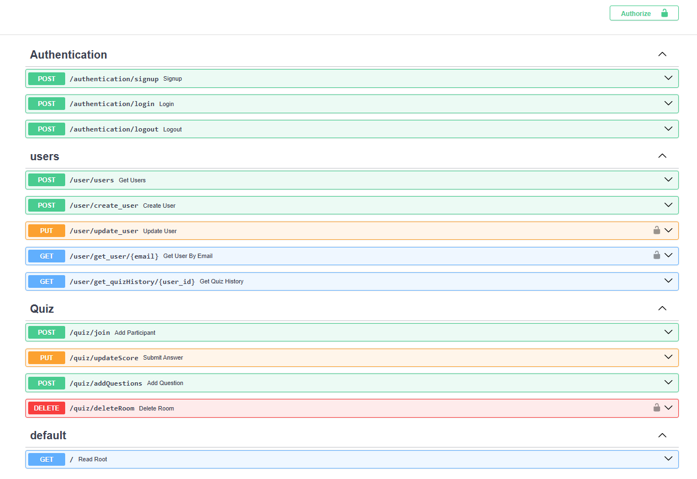

[](https://github.com/QuizCast/backend/actions/workflows/azure-serveless.yml)
[](https://supabase.com)

# QuizCast Backend

Welcome to the **QuizCast Backend** repository! This backend is built using Python's **FastAPI** framework, providing the core functionality and database management for the QuizCast platform. It handles user authentication, quiz management, leaderboard updates, and integrates seamlessly with **Supabase** for authentication, real-time database updates, and storage.

---

## Features

- **User Authentication:** Powered by Supabase (JWT tokens).
- **Quiz Management:** Create quizzes, add questions, and share quiz keys.
- **Real-time Updates:** Uses Supabase Realtime for live leaderboard updates and question broadcasts.
- **Profile Picture Upload:** Hosts can upload profile images, stored in Supabase's S3 bucket.
- **Docker Support:** Ready-to-use Docker container configuration for easy deployment.

---

## Prerequisites

1. Python 3.8+ installed.
2. `pip` package manager.
3. **Supabase** account and access to Supabase API.
4. `docker` and `docker-compose` (optional, for containerized deployment).

---

## Setup Instructions

### 1. Clone the Repository
```bash
git clone https://github.com/QuizCast/backend.git
cd backend
```

### 2. Create a Virtual Environment
```bash
python -m venv .venv
source ./.venv/bin/activate   # On Windows: venv\Scripts\activate
```

### 3. Install Dependencies
```bash
pip install -r requirements.txt
```

### 4. Configure Environment Variables
Create a `.env` file in the root directory and add the following variables:
```
SUPABASE_URL=<your_supabase_url>
SUPABASE_KEY=<your_supabase_api_key>
SUPABASE_BUCKET=<your_supabase_bucket_name>
SUPABASE_JWT_SECRET=<your_supabase_jwt_secret>
```

### 5. Run the Application
You can start the server using the following command:
```bash
uvicorn app.main:app --host 0.0.0.0 --port 8000
```

Alternatively, use Docker for a containerized setup:
```bash
docker build -t quizcast-backend .
docker run -p 8000:8000 quizcast-backend
```

---

## API Documentation

After starting the server, access the interactive API documentation (Swagger UI) at:
```
http://127.0.0.1:8000/docs
```
or the ReDoc version at:
```
http://127.0.0.1:8000/redoc
```

### Authentication Endpoints
- `/authentication/signup` - Sign up users.
- `/authentication/login` - Log in users.
- `/authentication/logout` - Log out users.

### User Endpoints
- `/user/users` - Retrieve all users.
- `/user/create_user` - Create a new user.
- `/user/update_user` - Update user details.
- `/user/get_user/{email}` - Retrieve user by email.
- `/user/get_quizHistory/{user_id}` - Retrieve quiz history.

### Quiz Endpoints
- `/quiz/join` - Join a quiz.
- `/quiz/updateScore` - Submit an answer and update score.
- `/quiz/addQuestions` - Add questions to a quiz.
- `/quiz/deleteRoom` - Delete a quiz room.

---

</img>

## Project Structure

```
backend/
│
├── app/
│   ├── main.py            # Entry point for the API
|   ├── api/               # Endpoints
│   ├── core/              # Configurations
│   ├── crud/              # Database Crud operations
│   ├── db/                # Supabase client setup using PythonSDK
|   ├── schemas/           # Pydantic Schemas for validation
|   ├── utils/ 
│
├── Dockerfile             # Docker configuration
├── requirements.txt       # Python dependencies
├── .env                   # Environment variables
├── startup.sh             # Startup script for the FastAPP
└── README.md              # Project documentation
```

---

## Contributing ❤️

We welcome contributions from the community! To get started:

1. Fork the repository.
2. Create a new branch:
   ```bash
   git checkout -b feature/your-feature-name
   ```
3. Commit your changes:
   ```bash
   git commit -m "Add some feature"
   ```
4. Push your branch:
   ```bash
   git push origin feature/your-feature-name
   ```
5. Create a pull request.

---

## License

This project is open-source and available under the MIT License.

---

## Contact

For questions or feedback, feel free to reach out or open an issue. Happy coding! 
